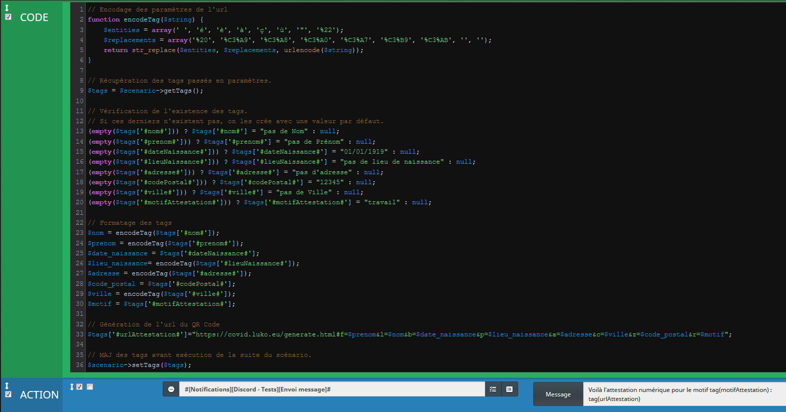
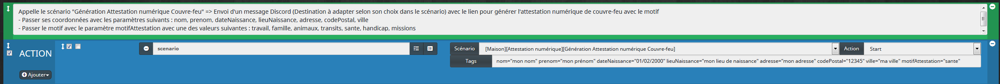

## Templates des scénarios

Les templates scénarios sont disponibles ici :

- [Génération Attestation numérique Couvre-feu](./templates/generation_attestation_numerique_couvre_feu.json)

- [Lancement attestation couvre feu](./templates/lancement_attestation_couvre_feu.json)

## Description des scénarios

- Le scénario "Génération Attestation numérique Couvre-feu" permet d'envoyer un message par Discord (avec la possibilité de remplacer par Telegram, Mail, etc..)
  
  Il attend en paramètres :
  - les coordonnées de l'utilisateur : nom, prenom, dateNaissance, lieuNaissance, adresse, codePostal, ville
  - et le motif de l'attestation : motifAttestation (valeurs possibles : travail, famille, animaux, transits, sante, handicap, missions)

- Le scénario "Lancement attestation couvre feu" appelle le scénario précédent "Génération Attestation numérique Couvre-feu"
  
  Il suffit de passer les paramètres attendus.

### Captures des scénarios

Génération Attestation numérique Couvre-feu

Lancement attestation couvre feu

Message généré sur Discord

Attestation numérique générée

