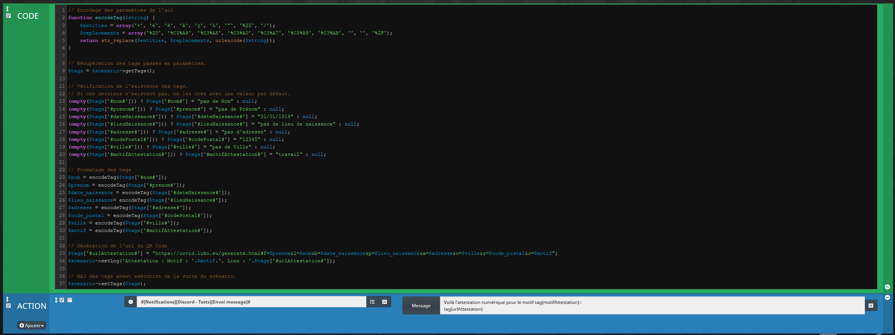
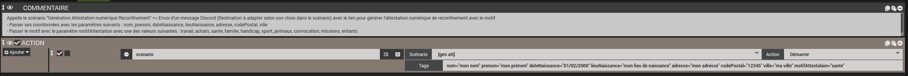
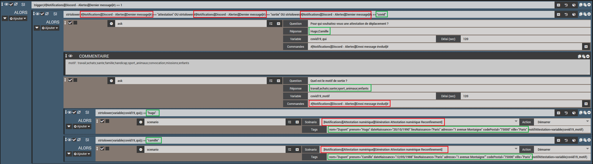
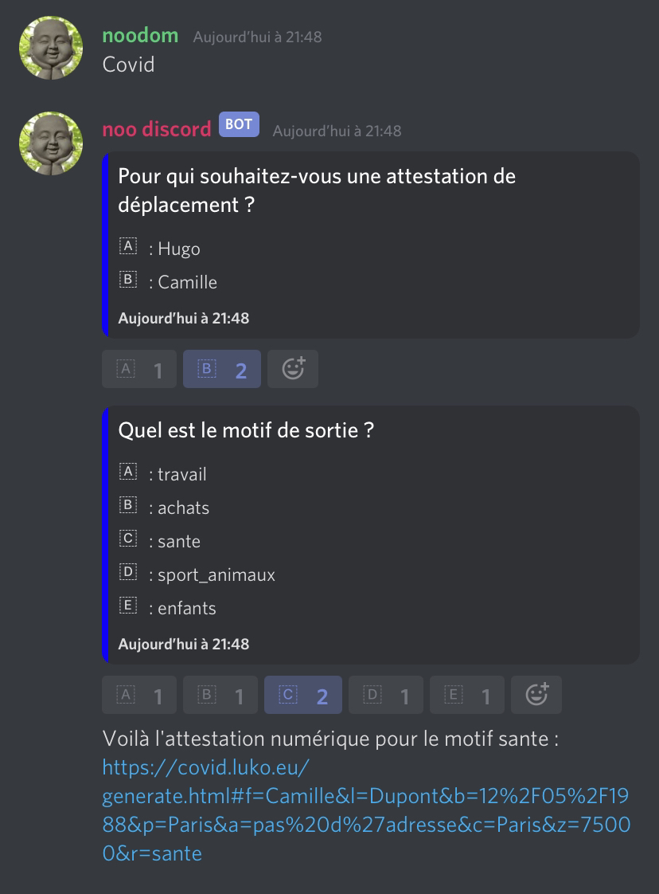
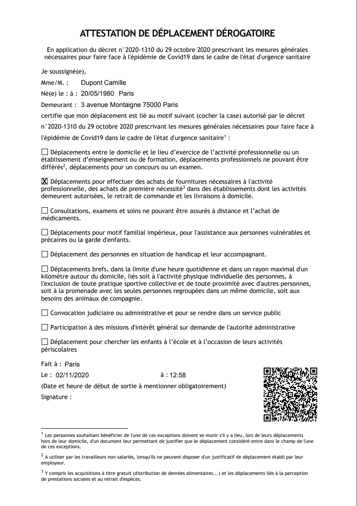

## Templates des scénarios

Les templates scénarios sont disponibles ici :

- [Génération Attestation numérique Reconfinement](./templates/generation_attestation.json)

- [Lancement Attestation Reconfinement](./templates/lancement_attestation.json)

- [Lancement Attestation Reconfinement avec Discord](./templates/askCovid.json)

## Description des scénarios

IMPORTANT : Les scénarios génèrent un lien pour l'attestation numérique.
La date et l'heure sur l'attestation seront celles correspondant au moment du clic sur le lien !
Bien penser à cliquer sur le lien au moment où vous souhaitez l'utiliser pour générer l'attestation et non pas attendre le contrôle (sinon la date de l'attestation sera l' heure du contrôle..) !

- Le scénario "Génération Attestation numérique Reconfinement" permet d'envoyer un message par Discord (avec la possibilité de remplacer par Telegram, Mail, etc..)
  
  Il attend en paramètres :
  - les coordonnées de l'utilisateur : nom, prenom, dateNaissance, lieuNaissance, adresse, codePostal, ville
  - et le motif de l'attestation : motifAttestation (valeurs possibles : travail, achats, sante, famille, handicap, sport_animaux, convocation, missions, enfants)

- Le scénario "Lancement Attestation Reconfinement" appelle le scénario précédent "Génération Attestation numérique Reconfinement"
  
  Il suffit de passer les paramètres attendus.
  
- Le scénario "ask covid" permet de faire une demande d'attestation numérique en passant par un questionnaire (Pour qui ? Quel motif ?)
  
  Pour l'exécuter, il suffit d'écrire le mot-clé "covid" depuis le channel Discord paramétré dans le scénario, puis de sélectionner la personne concernée et ensuite le motif

### Captures des scénarios

Génération Attestation numérique Reconfinement

Lancement attestation Reconfinement

Lancement attestation Reconfinement par Discord

- Modifier les commandes Jeedom (cadres en rouge)
- Modifier les renseignements personnels (cadres en vert)
- Il est possible de remplacer Discord par Telegram ou autres outils (méthode Ask habituelle) pour les demandes 

Message généré sur Discord

## Exemple d'exécution avec Discord

Attestation numérique générée

