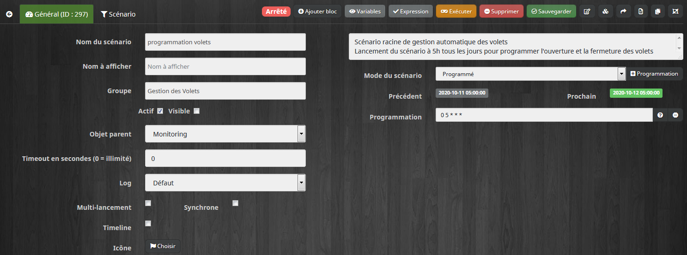
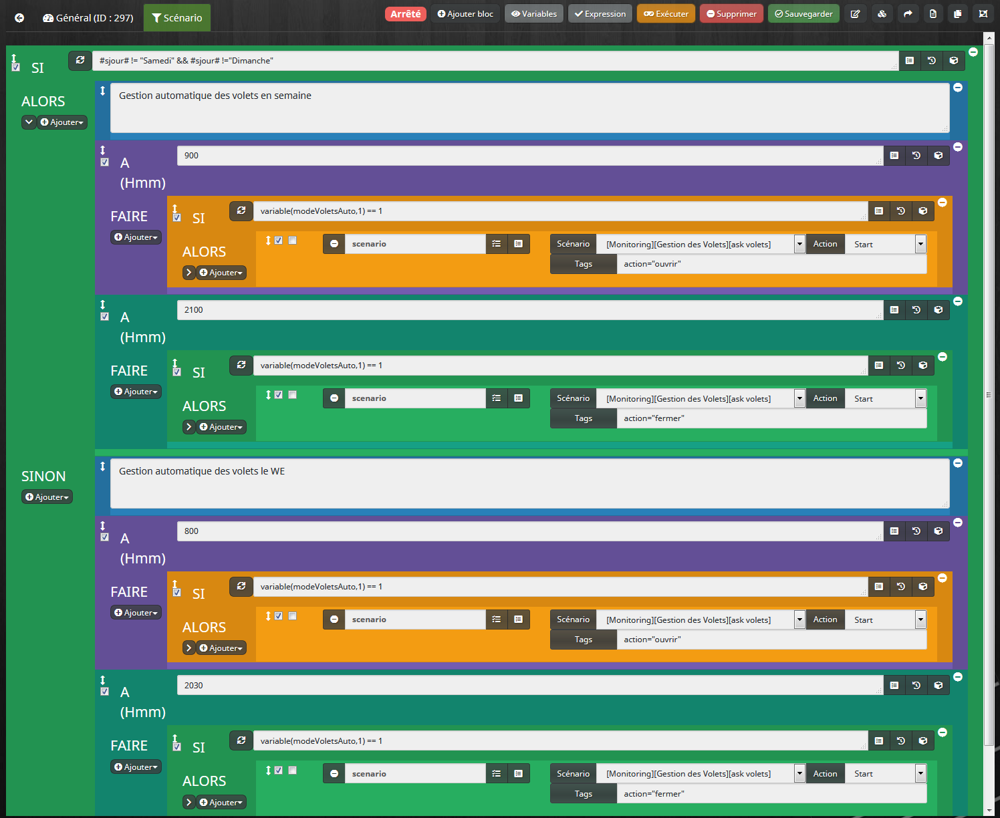
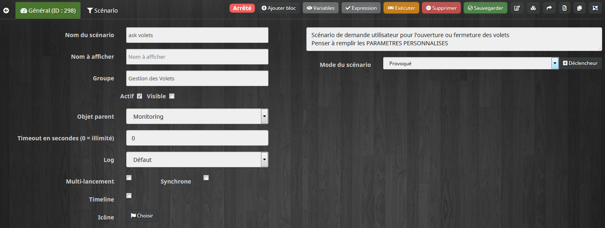
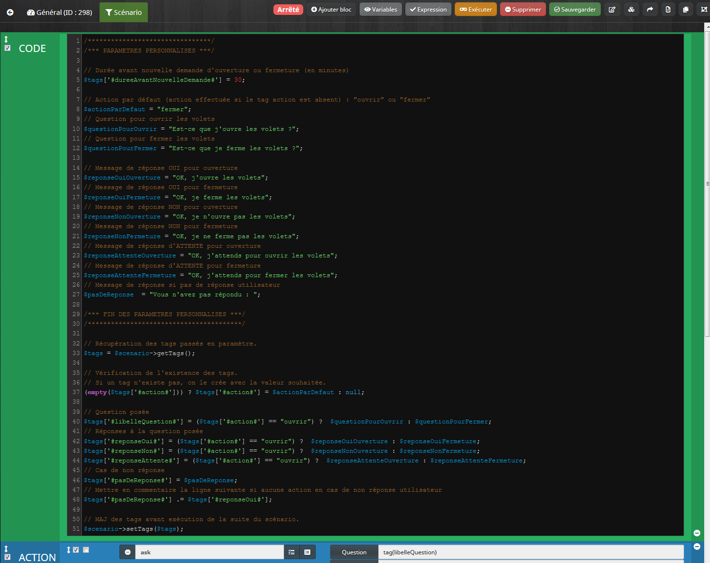
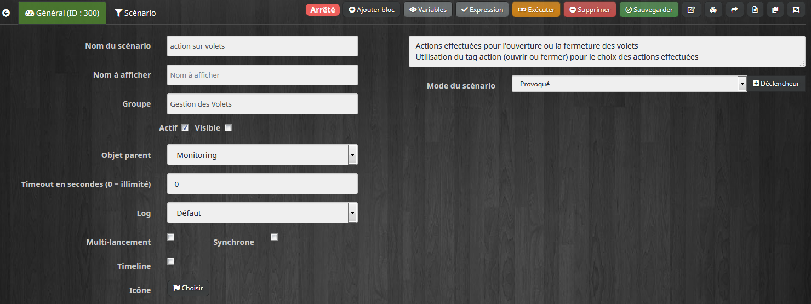
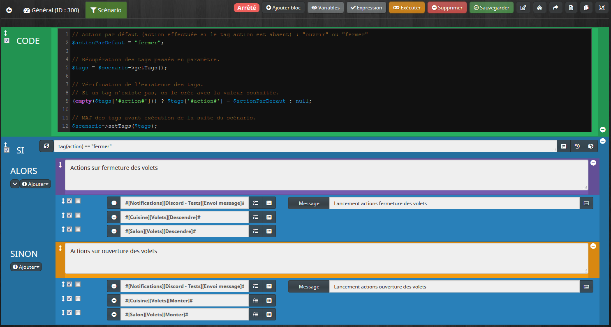
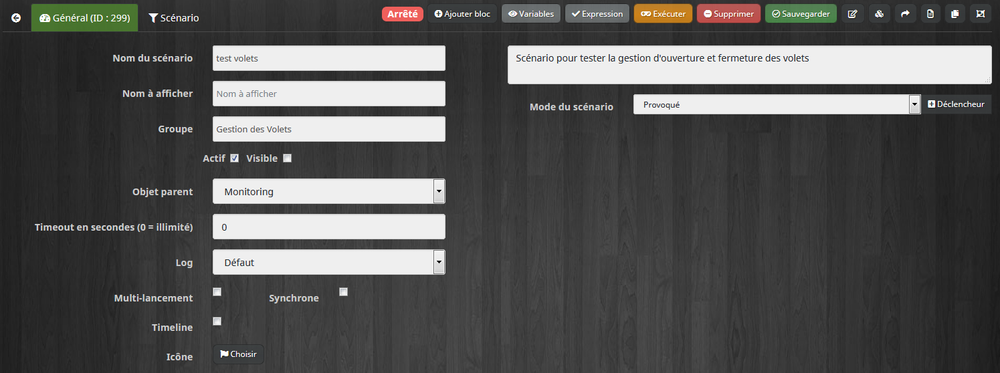
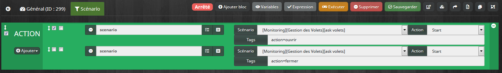

# Scénario de gestion d'ouverture et de fermeture des volets

Ces scénarios permettent d'automatiser l'ouverture et la fermeture des volets.
Les captures des scénarios sont visibles ci-dessous.

## Templates des scénarios

Les templates scénarios sont disponibles ici :

- [programmation volets](./templates/programmation_volets.json)

- [ask volets](./templates/ask_volets.json)

- [action sur volets](./templates/programmation_volets.json)

- [test volets](./templates/test_volets.json)

## Description des scénarios suivants de gestion des volets

- Le scénario "programmation volets" permet de déclarer la liste des heures d'ouverture et de fermeture des volets.
  Il est exécuté tous les jours à 5h pour prévenir Jeedom des actions à venir sur les volets dans la journée (paramètre "Programmation" dans l'onglet Général)

- Depuis l'onglet "Scénario", il faut alors définir les conditions et horaires souhaitées d'ouverture et de fermeture des volets.
  On peut donc définir une programmation en fonction des jours de la semaine, des heures, du lever ou coucher du soleil, de la météo, etc..
  (Il est alors possible d'utiliser les données de plugins pour les différents paramètres souhaités)
  Exemples :
    - **SI #sjour# != "Samedi" ET #sjour# != "Samedi"** : programmation pour les jours de la semaine (programmation du WE dans le SINON)
    - **A 900** pour 9h00, **A 2100** pour 21h

- Pour chacune de ces conditions, on demande alors à l'utilisateur si il souhaite confirmer l'ouverture ou la fermeture programmée par l'appel du scénario "ask volets" décrit plus loin

- Il est possible de désactiver la programmation automatique de gestion des volets.
  Il suffit de mettre à jour à tout moment la valeur de la variable **modeVoletsAuto** (mise à jour avec l'utilisation d'un bouton ON/OFF par exemple)
  Cette variable sera prise en compte pour lancer (ou non) la demande de confirmation à l'utilisateur. Avec une valeur à 0, aucune demande et donc action sur les volets ne sera effectuée.
  
- Suite au scénario précédent "programmation volets", le scénario "ask volets" sera exécuté et demandera une confirmation à l'utilisateur pour le lancement des actions
  - Définition des réponses possibles : OUI, NON, ATTENDS
  - Délai pour la réponse : 30
  - Sur réponse OUI, on lance les actions prévues avec l'appel du scénario "action sur volets"
  - Sur réponse NON, aucun action n'est lancée
  - Sur réponse "ATTENDS", les actions ne sont pas effectuées et ce scénario est relancé pour demander à nouveau l'exécution des scénarios plus tard (durée avant demande ayant comme valeur le tag **dureeAvantNouvelleDemande**)
  - Sans réponse, les actions sont automatiquement exécutées (avec la possibilité de modifier ce comportement en fin de scénario)
  
- Les actions effectuées au final sont appelées dans le scénario "action sur volets"
  - ALORS : actions de fermeture des volets
  - SINON : actions d'ouverture des volets

- Le scénario "test volets" permet de tester facilement le comportement des actions de fermeture ou d'ouverture exécutées par cette gestion des volets
  - Appel du scénario "ask volets" avec le tag **action** ayant pour valeur **ouvrir** ou **fermer**

## Récapitulatif des paramètres possibles :

- Les principaux paramètres sont accessibles dans le bloc code de début du scénario "ask volets" : voir PARAMETRES PERSONNALISES
  - Il faudra mettre en commentaire la ligne suivante de ce scénario si on ne fait aucune action sur non réponse :
    $tags['#pasDeReponse#'] .= $tags['#reponseOui#'];

- La programmation est modifiable selon ses souhaits si nécessaire dans le scénario "programmation volets" :
  - ajout/modification de SI, 
  - modification des heures 
  - modification des tags action (avec les valeurs ouvrir ou fermer)

- Paramétrage de la liste des actions dans le scénario "action sur volets"
  - C'est dans ce scénario qu'on ajoute la liste des actions à effectuer pour l'ouverture et la fermeture des volets (au niveau du SI pour la fermeture et du SINON pour l'ouverture)

## Améliorations possibles

- Gérer les horaires du scénario "programmation volets" par variables et remplacer les valeurs dans le scénario par le nom des variables
- Gérer les horaires du scénario "programmation volets" par calendrier (plugin Agenda par exemple) et déclencher le scénario sur les occurences de ces événements
  - Pour chaque heure de programmation, définir un événement dans le calendrier avec un rythme à préciser (ex : tous les jours à 9h, en semaine)
- Mettre les variables PARAMETRES PERSONNALISES du scénario dans un virtuel pour pouvoir les modifier depuis un Design par exemple

## Création des scénarios

### Scénario programmation volets

### Scénario ask volets

### Scénario action sur volets

### Scénario test volets

