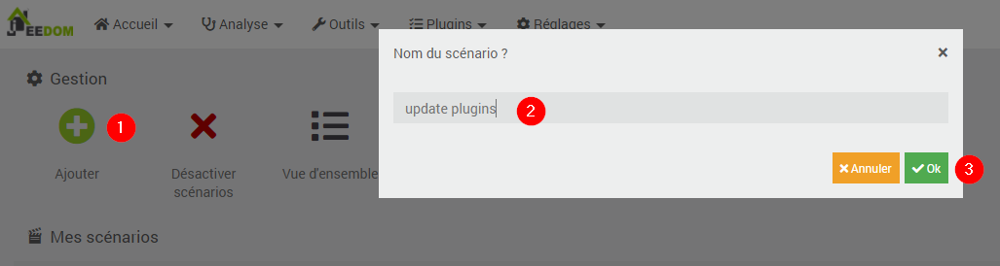
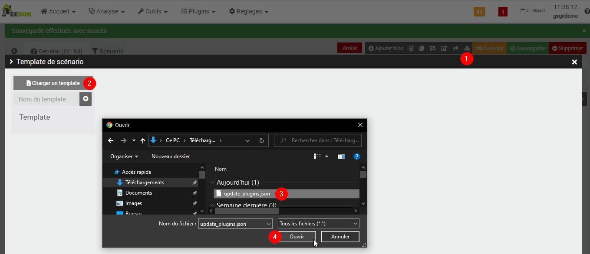
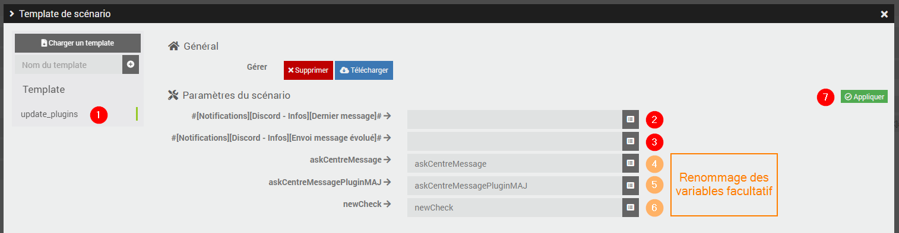

# Scénarios de mise à jour de plugins par menus Discord ou Telegram

Ces scénarios permettent d'effectuer des actions sur les plugins de son installation Jeedom à partir de menus **Discord** ou **Telegram**.
- Faire une sauvegarde d'un plugin
- Restaurer un plugin sauvegardé sur l'arborescence de Jeedom
- Mettre à jour un plugin depuis le Market Jeedom
- Supprimer une sauvegarde d'un plugin
- Faire une sauvegarde de Jeedom

## Template des scénarios

Les templates JSon des scénarios sont disponibles ici :

Pour Discord :

- [Demande d actions sur plugins (Discord)](./templates/demande_d_actions_sur_plugins_discord.json)

- [Exécution d actions sur plugins (Discord)](./templates/execution_d_actions_sur_plugins_discord.json)

- [update_plugins (Discord)](./templates/update_plugins_discord.json)

Pour Telegram :

- [Demande d actions sur plugins (Telegram)](./templates/demande_d_actions_sur_plugins_telegram.json)

- [Exécution d actions sur plugins (Telegram)](./templates/execution_d_actions_sur_plugins_telegram.json)

- [update_plugins_telegram (Telegram)](./templates/update_plugins_telegram.json)

## Description des scénarios de mise à jour des plugins par Discord ou Telegram

Version Discord :

- Le scénario **"Demande d actions sur plugins Discord"** propose un menu pour faire la demande de sauvegarde d'un plugin de son Jeedom, de restaurer une sauvegarde d'un plugin vers son Jeedom, de mettre à jour un plugin depuis le Market Jeedom, de supprimer une sauvegarde d'un plugin, de faire un backup de Jeedom.
  Les actions sélectionnées provoque l'appel des scénarios "Exécution d actions sur plugins Discord" et "update plugins Discord" pour effectuer les actions demandées.
  C'est le scénario principal appelé par l'utilisateur.

  Il est exécuté :
    - en le déclenchant depuis Discord avec les mot-clés "backup" ou "backups" : peut-être supprimé des déclencheurs si non souhaité

- Le scénario **"Exécution d actions sur plugins Discord"** permet d'effectuer les actions demandées par le scénario "Demande d actions sur plugins Discord"

- Le scénario **"update plugins Discord"** permet d'effectuer des mises à jours des plugins Jeedom depuis un menu Discord.
  Il permet de récupérer la liste des plugins disponibles pour une mise à jour et de choisir les plugins à mettre à jour.
  Il peut être appelé directement par l'utilisateur et est aussi appelé par le scénario "Demande d actions sur plugins"

  Il est exécuté :
    - toutes les heures (aucune action si aucun nouveau plugin disponible) : peut-être supprimé des déclencheurs si non souhaité
    - en le déclenchant depuis Discord avec le mot-clé "plugins" : peut-être supprimé des déclencheurs si non souhaité
    - si appelé depuis le menu "Mise à jour" du scénario "Demande d actions sur plugins"

Version Telegram :

- Le scénario **"Demande d actions sur plugins Telegram"** propose un menu pour faire la demande de sauvegarde d'un plugin de son Jeedom ,de restaurer une sauvegarde d'un plugin vers son Jeedom, de mettre à jour un plugin depuis le Market Jeedom, de supprimer une sauvegarde d'un plugin.
  Les actions sélectionnées provoque l'appel des scénarios "Exécution d actions sur plugins Telegram" et "update plugins Telegram" pour effectuer les actions demandées.
  C'est le scénario principal appelé par l'utilisateur.

- Le scénario **"Exécution d actions sur plugins Telegram"** permet d'effectuer les actions demandées par le scénario "Demande d actions sur plugins Telegram"
 
- Le scénario **"update plugins Telegram"** permet d'effectuer des mises à jours des plugins Jeedom depuis un menu Telegram.
  Il permet de récupérer la liste des plugins disponibles pour une mise à jour et de choisir les plugins à mettre à jour

  Il est exécuté :
    - toutes les heures (aucune action si aucun nouveau plugin disponible)
    - si appelé depuis le menu "Mise à jour" du scénario "Demande d actions sur plugins Telegram"

## Installation du template de scénario

- Télécharger les templates JSon souhaités : 
  - [Demande d actions sur plugins Discord](./templates/demande_d_actions_sur_plugins_discord.json)
  - [Exécution d actions sur plugins Discord](./templates/execution_d_actions_sur_plugins_discord.json)
  - [update_plugins Discord](./templates/update_plugins_discord.json)
  - [Demande d actions sur plugins Telegram](./templates/demande_d_actions_sur_plugins_telegram.json)
  - [Exécution d actions sur plugins Telegram](./templates/execution_d_actions_sur_plugins_telegram.json)
  - [update_plugins Telegram](./templates/update_plugins_telegram.json)

- Créer un nouveau scénario

- Charger le template téléchargé pour le scénario créé

- Adaptation des paramètres à son propre Jeedom (commandes d'un équipement du plugin DiscordLink ou Telegram et renommage éventuel des variables utilisées)

- ATTENTION : 
  - les scénarios "Demande d actions sur plugins Discord" et "Demande d actions sur plugins Telegram" appellent d'autres scénarios à renseigner et activer (voir commentaires dans le premier bloc Code du scénario)
  - les scénarios "Demande d actions sur plugins Discord" et "Demande d actions sur plugins Telegram" ont des tags à modifier (obligatoire pour le tag **"discordMessageEvolueId"** (respectivement **"telegramMessageId"**), facultatif avec valeurs par défaut pour les autres)  
  - les scénarios 'update plugins Discord" et "update plugins Telegram" s'appellent eux-même. Il faut remplacer "scénario Aucun" par "scénario nomScenarioUpdate"

## Déroulement du scénario

### Mise à jour d'un plugin

### Annulations de la mise à jour

