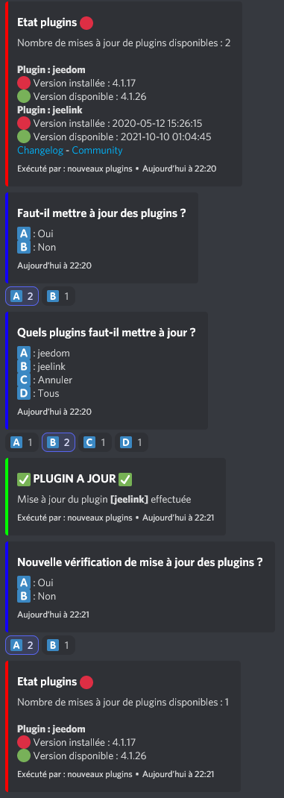
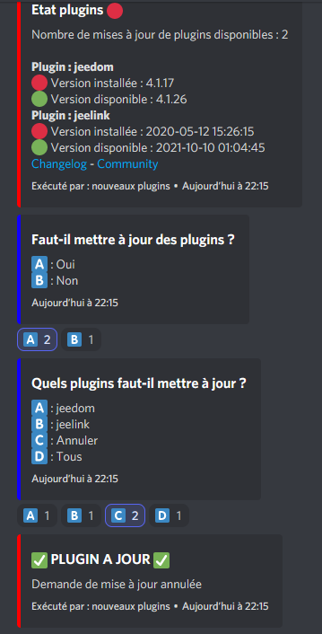
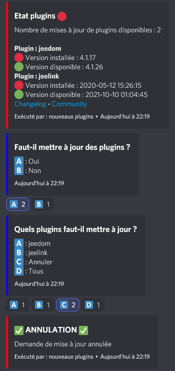

# Scénario de mise à jour de plugins par menus Discord

Ce scénario permet d'effectuer la mise à jour de plugins à partir de menus Discord.

## Template du scénario

Le template du scénario est disponible ici (export depuis Jeedom) :

- [update_plugins](./templates/update_plugins.txt)

## Description du scénario de mise à jour des plugins par Discord

- Le scénario "update plugins" permet d'effectuer des mises à jours des plugins Jeedom depuis un menu Discord.
  Il permet de récupérer la liste des plugins disponibles pour une mise à jour et de choisir les plugins à mettre à jour

  Il est exécuté :
    - toutes les heures
    - en le déclenchant depuis Discord avec le mot-clé "plugins"

## Déroulement du scénario

### Mise à jour d'un plugin

### Annulations de la mise à jour

